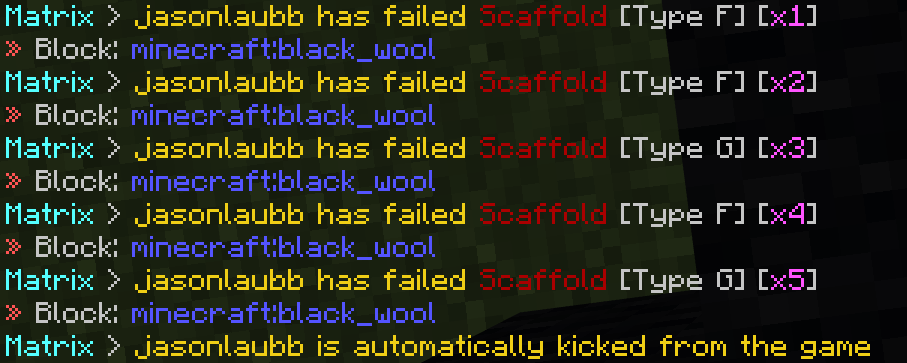
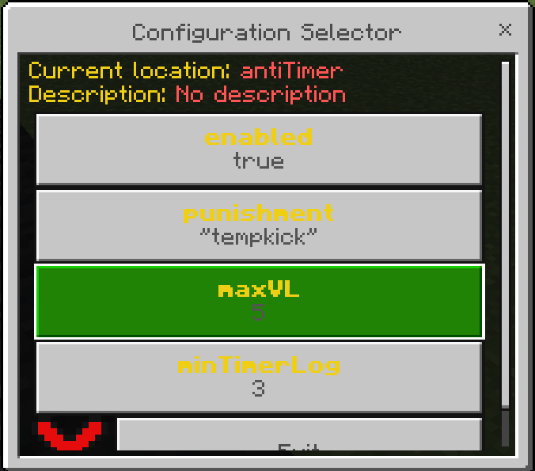

# Intruduce for auto-action

Do you feel tired on watching every player movement and state wether they are hacker or not?

Auto-action of the anticheat can help you a lot. In this page, you will know about auto-action.

# Flag mode

Flag mode stated that how anticheat notice the message that include the type of the hack and who is the hacker.

Flagmode has few modes:

- admin: Send the flag message to all 'admin's

- all: Send the flag message to all players

- tag: Send the flag message to all players with the `matrix:notify' tag

- bypass: Send the flag message to all players but not including the hacker

- none: Do not send the flag message

The different flag mode is `admin`.

To change the flag mode, you can use the chat command `<prefix>flagmode <flag mode>`.

# VL upper limit

Do you know what is VL? VL is the upper limit of flag for each modules of the anticheat.

If you reached the VL upper limit of a module, you can get the punishment from the anticheat.

To change it you can use 'dynamic config' to archive that, this will be introduced later.

# Log record

If you wanna know what happened while you're not looking at the chat message, you can use the log record.

To open the log record, you can use the chat command `<prefix>openlog`.

