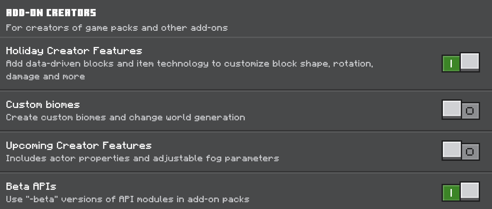
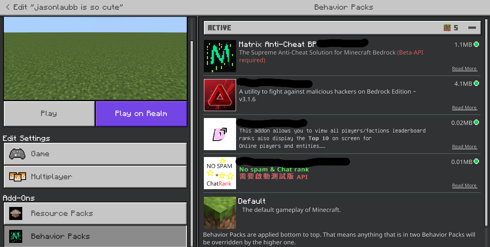
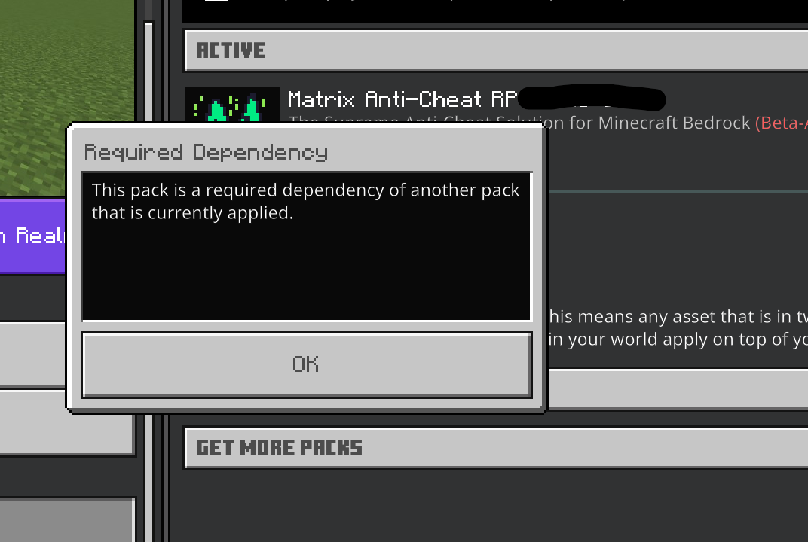
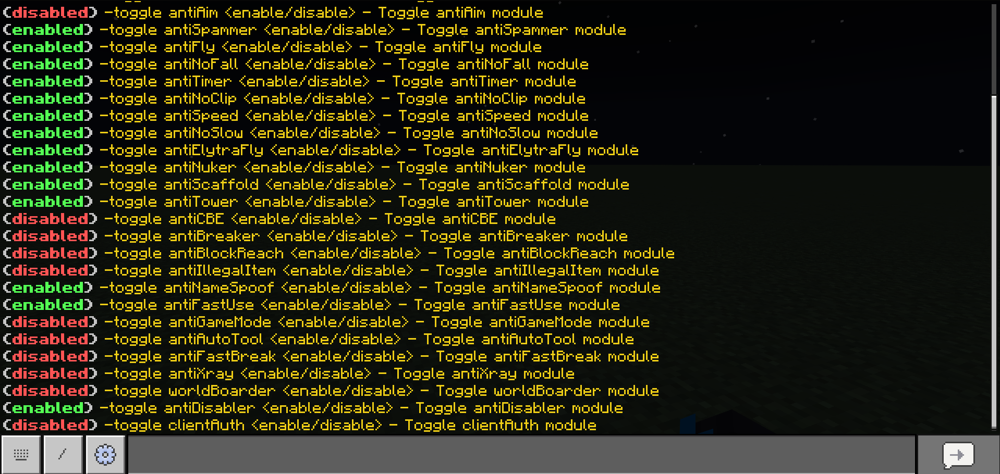

# Setup

Setup Matrix is very easy, you can learn how to setup Matrix on your realm or server in this page.

# World settings

Beta API is required for basically script of the AntiCheat work

Also, if you want to use custom item in the pack.

For example item ui, you will need to also use the holiday creator feature.

# Install the addon

Use the pack (`Matrix-vX.X.X.mcaddon`) and install the pack to your client.

Now, pull your pack to the world. The both behavior and the resource pack should **on the top** among all the other packs.

You **cannot remove the resource pack** while you installed the behavior pack.

# Get the admin permission

Run the chat command `<prefix>op password` on your chat.

The prefix should be `-` if you didn't change anything before.

# Change the password

Run the chat command `<prefix>passwords <current password> <new password>` on your chat.

Please **don't forget your password**, the password cannot be found again.

You need to use `<prefix>reset` to reset all the data of the anticheat for clearing the password.

# Checking the setup

First, check if the anticheat modules you needed are toggled on in the server.

You can check the toggle status by running the chat command `<prefix>toggles` on your chat.

# Everything is ready

Your server is contains the great protection of the anticheat.

Use help command `<prefix>help` to get the list of commands.